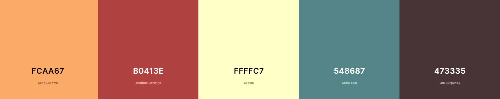
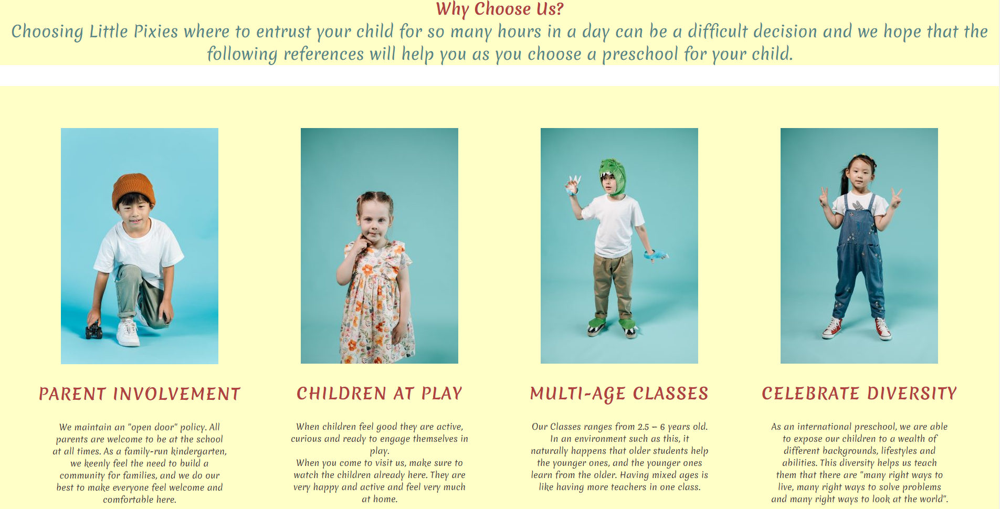

# **_Little Pixies - Kindergarten_**

Don't we all have a dream for ourselves??

A good child care facility needs the kind of people who will act as a unifying force and pull the program together to make it cohesive.

We have a vision of the kind of child care we want to provide and we are filled with the enthusiasm & perseverance to accomplish this.

We are living our dream, and we hope to continue year after year with your support. Let our dream inspire your children!!

Welcome to Little Pixies<a href="https://andr3w88.github.io/little-pixies-kindergarten/" target="_blank">Kindergarten</a>

# Contents

* [**User Experience UX**](<#user-experience-ux>)
    *  [User Stories](<#user-stories>)
    * [Site Structure](<#site-structure>)
    * [Design Choices](<#design-choices>)
    *  [Typography](<#typography>)
    *  [Colour Scheme](<#colour-scheme>)
* [**Features**](<#features>)
    * [**Home**](<#navigation-menu>)
         * [Navigation menu](<#navigation-menu>)
        * [Header](<#herader>)
         * [About-us](<#about-us>)
         * [Feller](<#feller>)
         * [Testimonials](<#testimonials>)
         * [Footer](<#footer>)
    * [**About Us**](<#about>)
     * [**Teachers**](<#teachers>)
    * [**Classes**](<#classes>)
    * [**Events**](<#events>)
    * [**Gallery**](<#gallery>)
    * [**Contact**](<#contact>)
* [**Future Features**](<#future-features>)
* [**Technologies Used**](<#technologies-used>)
* [**Testing**](<#testing>)
* [**Deployment**](<#deployment>)
* [**Credits**](<#credits>)
    * [**Content**](<#content>)
    * [**Media**](<#media>)
*  [**Acknowledgements**](<#acknowledgements>)

# User Experience (UX)

## User Stories

* As a user I want to be able to navigate through the whole site smoothly.
* As a user I want to understand the purpose of the site upon loading it.
* As a user I want to easily be able to contact Little Pixies for more information.
* As a user I want to know more about Little Pixies.
* As a user I want to know how other kids experiences with Little Pixies has been.

[Back to top](<#contents>)

## Site Structure

Little Pixies website has seven pages. The [Little Pixies page](index.html) is the default loading page, [About Us](about.html), [Teachers](teachers.html), [Classes](classes.html), [Events](events.html), [Gallery](gallery.html) and [Contact](contact.html) pages are all accessible primarily from the navigation menu. There are another 2 links to the About Us page and Contact page in the header section and filler section to give the user some guidance to the next step of the journey. 
On every page there are also links of every page in the footer section.

[Back to top](<#contents>)
## Design Choices

 * ### Typography
      The font chosen is 'Merienda' for the body text. They fall back to cursive and sans-serif respectively. 
      * 'Merienda' is a nice handwriting font for the purpuse of parents kids, being easy to read for all.

 * ### Colour Scheme
      The colour scheme eventually chosen was a mix of 5 colors.  Sandy Brown a shade of  orange,   
    Medium Carmine a shade of red, Cream a shade of white, Steal Teal a shade of blue and Old Burgundy a shade of maro. This is something that Little Pixies can hopefully pass onto the user.

[Back to top](<#contents>)
# Features

Little Pixies site is set up to be welcoming and easy to use. It contains many features that the user can acces them easily such as About Us and Contact. The rest of  the website is intended to give more info in every other section that user can explore further. 

## Existing Features  
  * ### Navigation Menu

    * Sited at the top of all the pages in the site, it is fully responsive and contains links to all the pages of the site to enable ease of navigation in one convenient location.
    * The logo is clickable with a link back to the home page for enhanced UX.

[Back to top](<#contents>)

* ### Header 

    * Header have a welcome text to our kindergarten with a sentence and 2 buttons
    * Read More button have a link to about us page
    * Contact Us button have a link to contact page

[Back to top](<#contents>)

  * ### About-Us
    * The About Us section lets the user know what Little Pixies is and who we are. 
    * A combination of kids pictures and the text bellow describe a few skils that we have
    

[Back to top](<#contents>)

* ### Feller
    
    * The feller have a background image and on top a text with our name Little Pixies - Kindergarten and 2 buttons to falicitate a quick acces further. 
    * Read More button have a link to about us page
    * Contact Us button have a link to contact page
   
    

[Back to top](<#contents>)

  * ### Testimonials

    * The testimonials section provides the user with some feedback from previous kids. There are four testimonials displayed a kid parent image with a text.
    * Testimonials are updated on the last year of the selected children

[Back to top](<#contents>)

* ### Footer
    
    * Footer begin with our name again Little Pixies - Kindergarten and have 3 section wich are: Office, Links and Newsletter
    * Office section contain the Address, email id and a Number mobile phone
    * Links section contain all pages available.
    * Newsletter section  contain again a email option to contact us and 4 social media under the horizontal line 
    

[Back to top](<#contents>)

* ### About Us

    * The About Us page give the user a further details about our skils 

[Back to top](<#contents>)

* ### Teachers
    * Teachers page contain a list of teachers image with a name and what domain are specialise in

[Back to top](<#contents>)

* ### Classes
    * Classes page contain 4 image with asociated details title and text 

[Back to top](<#contents>)

* ### Events
     * Events page contain a background image and 4 diferents events. 
     * Each one details is style as back text hiden

[Back to top](<#contents>)

* ### Gallery
     * Gallery page contain few images with kids from Little Pixies - Kindergarten

[Back to top](<#contents>)

* ### Contact 

    * This section should complete the online journey for the user. 
    * It has a background image
    * There is a form that the user can choose to fill in. It has 5 input fields, first name, last name, phone number, email id, and a textarea. A submit button lets Little Pixies know if the user complete a form

[Back to top](<#contents>)

## Future Features 

* A 'Shop' page/section with products that help kids to play in.
* Classes Timetable section for the whole week / month

[Back to top](<#contents>)

# Technologies Used
* [HTML5](https://html.spec.whatwg.org/) - provides the content and structure for the website.
* [CSS](https://www.w3.org/Style/CSS/Overview.en.html) - provides the styling.
* [Gitpod](https://www.gitpod.io/#get-started) - used to deploy the website.
* [Github](https://github.com/) - used to host and edit the website.

[Back to top](<#contents>)

# Testing

Please refer to [**_here_**](TESTING.md) for more information on testing Wawas Woods.

[Back to top](<#contents>)

# Deployment

### **To deploy the project**
The site was deployed to GitHub pages. The steps to deploy a site are as follows:
  1. In the GitHub repository, navigate to the **Settings** tab.
  2. Once in Settings, navigate to the **Pages** tab on the left hand side.
  3. Under **Source**, select the branch to **main**, then click **save**.
  4. Once the master branch has been selected, the page will be automatically refreshed with a detailed ribbon display to indicate the successful deployment.

  The live link to the Github repository can be found here - https://github.com/Andr3w88/little-pixies-kindergarten

### **To fork the repository on GitHub**
A copy of the GitHub Repository can be made by forking the GitHub account. This copy can be viewed and changes can be made to the copy without affecting the original repository. Take the following steps to fork the repository;
1. Log in to **GitHub** and locate the [repository](https://github.com/Andr3w88/little-pixies-kindergarten).
2. On the right hand side of the page inline with the repository name is a button called **'Fork'**, click on the button to create a copy of the original repository in your GitHub Account.

### **To create a local clone of this project**
The method from cloning a project from GitHub is below:

1. Under the repository’s name, click on the **code** tab.
2. In the **Clone with HTTPS** section, click on the clipboard icon to copy the given URL.

3. In your IDE of choice, open **Git Bash**.
4. Change the current working directory to the location where you want the cloned directory to be made.
5. Type **git clone**, and then paste the URL copied from GitHub.
6. Press **enter** and the local clone will be created.

[Back to top](<#contents>)

# Credits
### Content

* The font came from [Google Fonts](https://fonts.google.com/).
* The colour palate was compiled by [Coolors](https://coolors.co/).
* The icons came from [Font Awesome](https://fontawesome.com/).

### Media
* The photos all came from [Pexels](https://www.pexels.com/).

[Back to top](<#contents>)

# Acknowledgements
The site was completed as a Portfolio 1 Project piece for the Full Stack Software Developer (e-Commerce) Diploma at the [Code Institute](https://codeinstitute.net/). As such I would like to thank my mentor [Precious Ijege](https://www.linkedin.com/in/precious-ijege-908a00168/), the Slack community, and all at the Code Institute for their help and support. Little Pixies  is a fictional company but it exists in everything but the business title. 

Andr3w88 2022.

[Back to top](<#contents>)