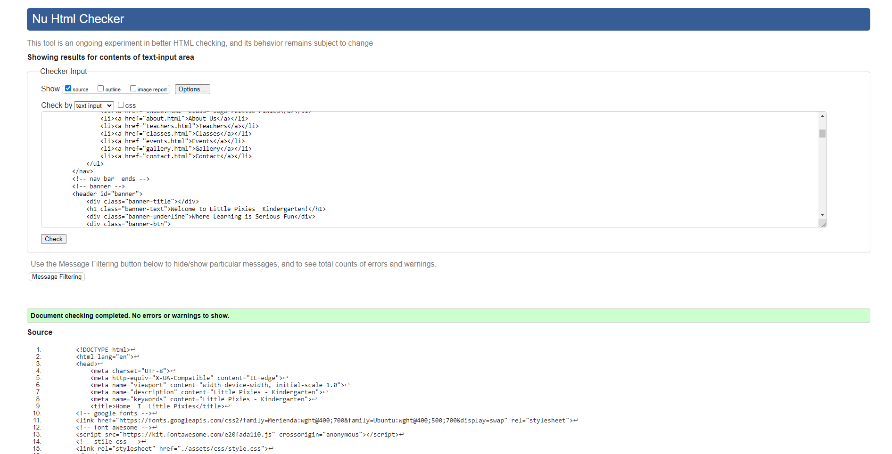
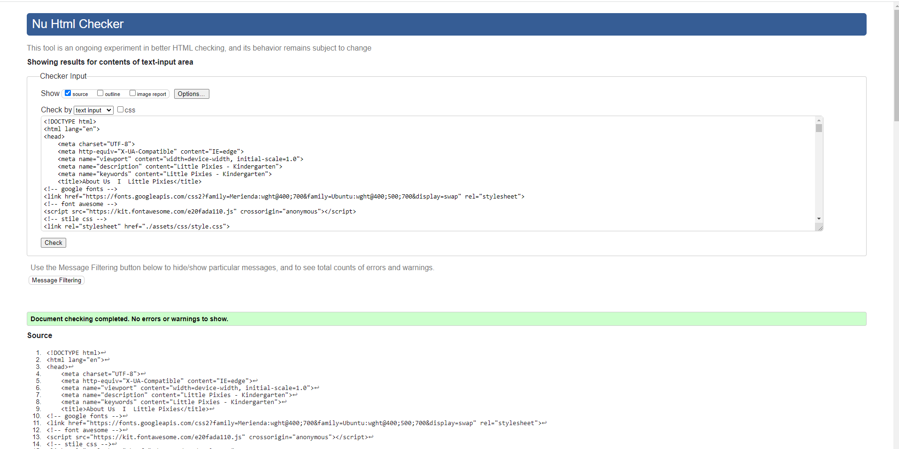
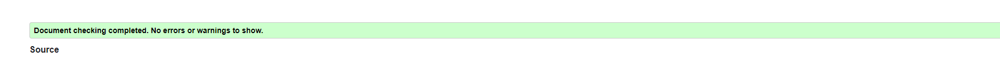
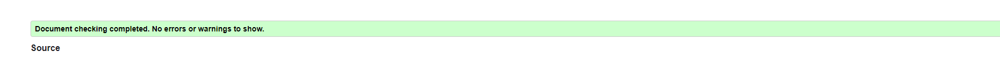
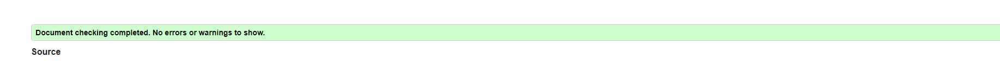
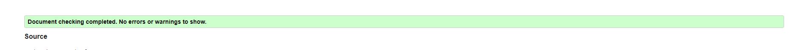
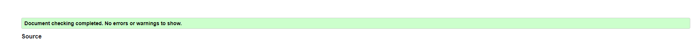
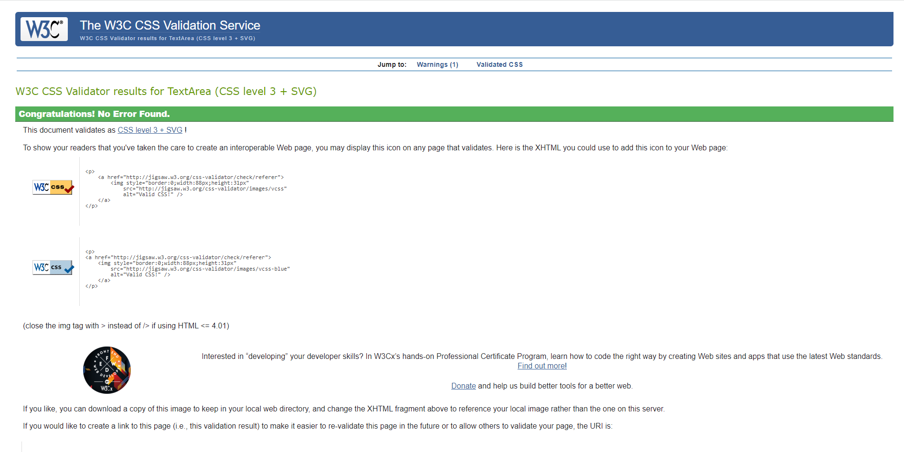
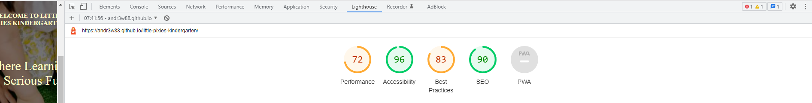

# **_TESTING_**
## **_Code Validation_**
Code Validation
The Wawas Woods site has be throughly tested. All the code has been run through the [W3C html Validator](<#https://validator.w3.org/>) and the [W3C CSS Validator](<#https://jigsaw.w3.org/css-validator/>). Minor errors were found on the home and inspiration pages. After a fix and retest, no errors were returned for both.

The HTML validator results for each page are below:

* [**Home**](<#index>)

* [**About Us**](<#about>)

 * [**Teachers**](<#teachers>)
(
 * [**Classes**](<#classes>)

* [**Events**](<#events>)

* [**Gallery**](<#gallery>)

* [**Contact**](<#contact>)

The CSS validator results are below:

## **_Responsiveness Test_**
## **_Browser Compatibility_**
## **_Testing User Stories_**
## **_Known Bugs_**
* [**Resolved**](<#index>)
* [**Unresolved**](<#index>)
## **_Additional Testing_**

### **_Lighthouse_**

The site was also tested using [**Google Lighthouse**](<#Google Lighthouse>)  in Chrome Developer Tools to test each of the pages for:

* Performance - How the page performs whilst loading.
* Accessibility - Is the site acccessible for all users and how can it be improved.
* Best Practices - Site conforms to industry best practices.
* SEO - Search engine optimisation. Is the site optimised for search engine result rankings.

As an example the results for Wawas Woods home page are below:

This part of the testing process showed up that the site was slow to load, mainly due to the image sizes. All the images needed to be compressed before adding to the repository. Once this was done the performance went from ~45% to ~70%. 